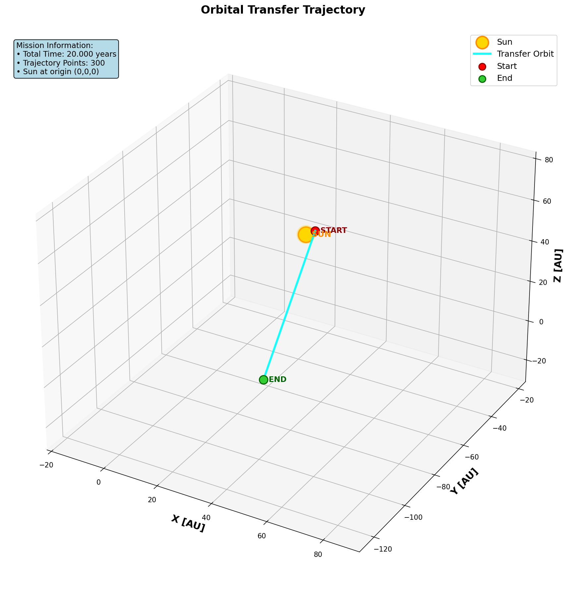
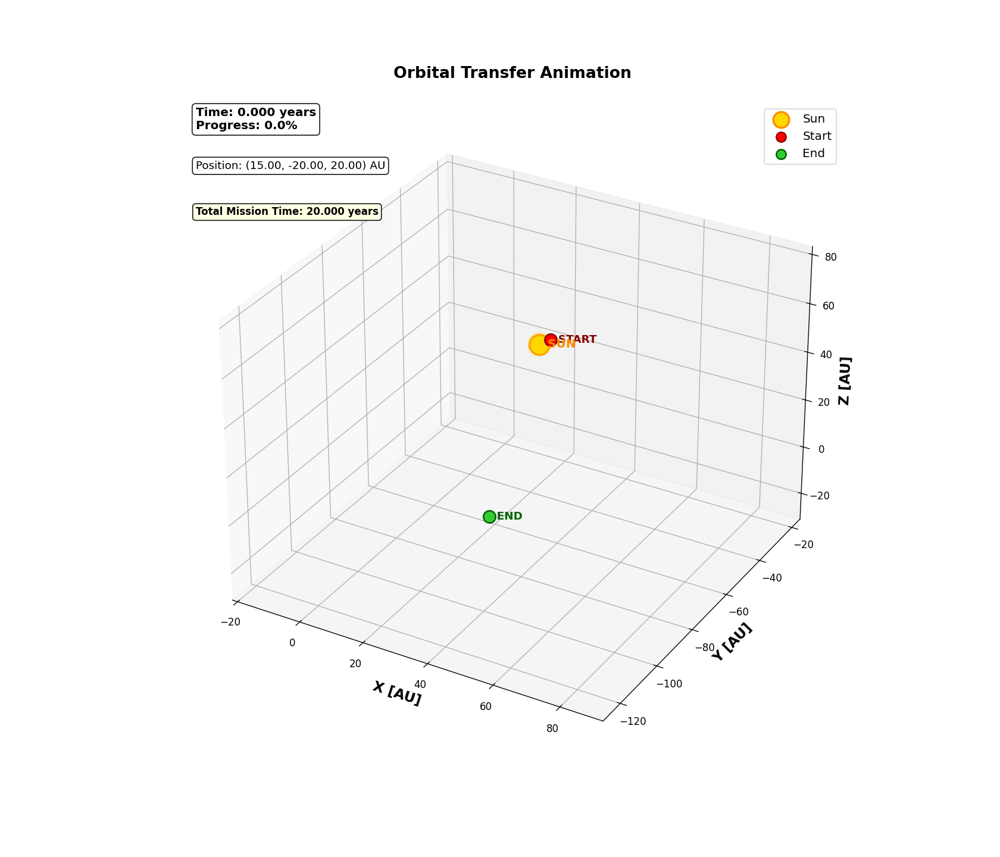
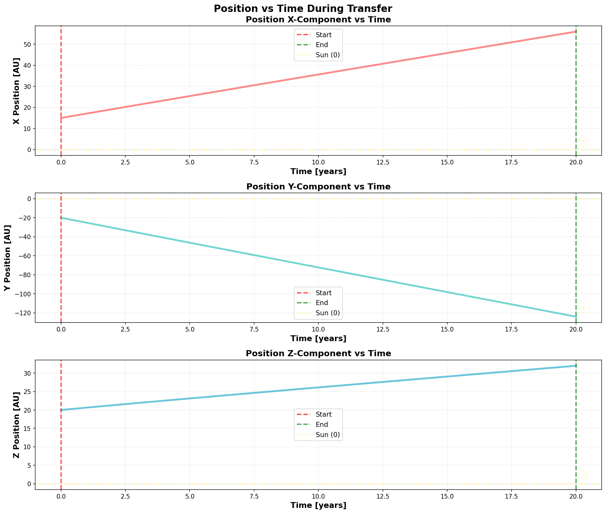
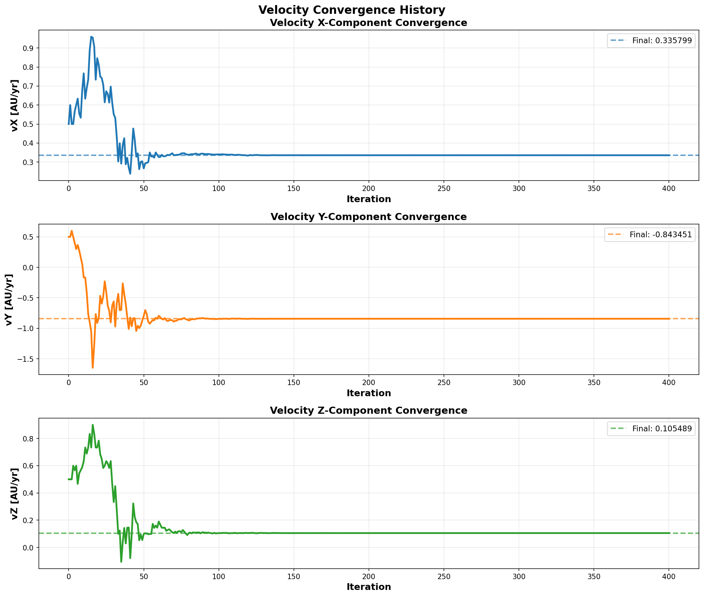
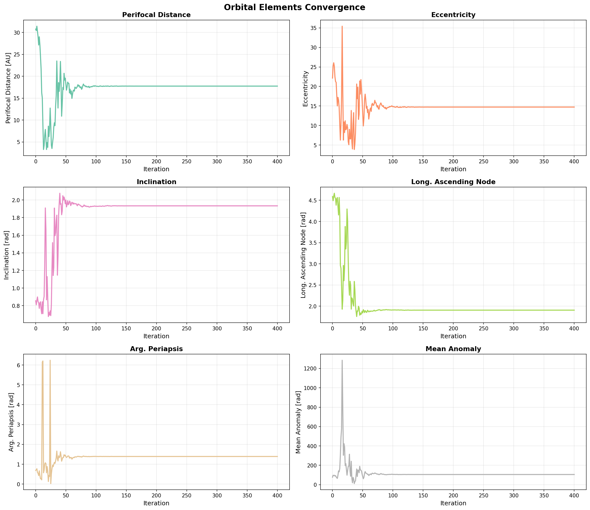

# Orbital Transfer Velocity Solver Using Nelder-Mead Optimization

## Abstract
This document describes a numerical method for solving the two-point boundary value problem in orbital mechanics without using Lambert's theorem. The solver finds the initial velocity vector required to transfer a spacecraft between two arbitrary positions around the Sun within a specified time, using the Nelder-Mead optimization algorithm.

## Installation
```bash
!pip install -Uq pymcel rebound
```

Additional required libraries
```bash
pip install numpy matplotlib spiceypy
```

## Mathematical Formulation
### Units
The system uses the following canonical units:
- **Length**: Astronomical Unit (AU) = $1.495978707\times10^{11}$ m
- **Time**: Year (yr) = $3.15576\times10^{7}$ s
- **Mass**: Solar mass ($M_{\odot}$) = $1.9885\times10^{30}$ kg

The gravitational parameter $\mu$ in these units is:
$$
\mu = 1 \quad \text{[AU}^3/\text{yr}^2]
$$

### Two-Body Propagation
The core dynamics use the two-body equation:
$$
\ddot{\vec{r}} = -\frac{\mu}{r^3}\vec{r}
$$
where $\vec{r} = [x, y, z]^T$ is the position vector in AU.

The state vector is defined as:
$$
\vec{S} = [x, y, z, v_x, v_y, v_z]^T
$$

Propagation from time $t_0$ to $t_f$ is performed:
$$
\vec{S}(t_f) = \text{prop2b}(\mu, \vec{S}(t_0), t_f - t_0)
$$

### Optimization Problem
Given:
- Initial position: $\vec{r}_1 = [x_1, y_1, z_1]^T$
- Target position: $\vec{r}_2 = [x_2, y_2, z_2]^T$
- Transfer time: $T$ (years)

Find initial velocity $\vec{v}_1 = [v_x, v_y, v_z]^T$ that minimizes:
$$
J(\vec{v}_1) = \|\vec{r}(T) - \vec{r}_2\|
$$

where $\vec{r}(T)$ is the propagated position at time $T$.

### Nelder-Mead Optimization
The solver uses the Nelder-Mead simplex algorithm to minimize the objective function $J(\vec{v}_1)$. The algorithm parameters are:

- Reflection coefficient: $\alpha = 1.0$
- Expansion coefficient: $\gamma = 2.0$
- Contraction coefficient: $\rho = 0.5$
- Shrink coefficient: $\sigma = 0.5$
- Convergence tolerance: $\epsilon = 10^{-8}$ AU

## Code Features
### Input Parameters
The solver accepts:
- Initial position $\vec{r}_1$ [AU]
- Target position $\vec{r}_2$ [AU]
- Transfer time $T$ [years]

### Output Files
- 3D static plot of the transfer orbit


- Animated GIF showing spacecraft motion


- Position components vs time


- Optimization convergence history


- Orbital elements during optimization



### Orbital Elements Calculation
After finding the optimal velocity, the orbital elements are computed:
$$
[a, e, i, \Omega, \omega, M_0] = \text{oscelt}(\vec{S}_{\text{final}}, 0, \mu)
$$

where:

- $a$: Semi-major axis [AU]
- $e$: Eccentricity
- $i$: Inclination [rad]
- $\Omega$: Longitude of ascending node [rad]
- $\omega$: Argument of periapsis [rad]
- $M_0$: Mean anomaly at epoch [rad]

### Assumptions

- Two-body dynamics: Only Sun's gravity considered
- Point masses: No planetary perturbations
- Inertial frame: Barycentric coordinate system
- No maneuvers: Single impulse transfer
